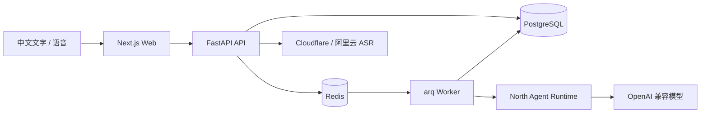

# Dayboard

**用中文自然语言和语音管理日程与待办的 AI 助手。**

Dayboard 可以理解“明天下午三点提醒我开会”“下班后拿快递”这类日常表达，
自动创建、查询和调整日程或待办；信息不足时，它会先向你确认，而不是猜测后直接写入数据。

[在线体验](https://www.selfapi.art/dayboard) ·
[项目文档](./docs/README.md) ·
[部署指南](./docs/deploy.md) ·
[当前进度](./docs/PROJECT_STATE.md)

> 项目正在持续开发，当前优先服务中文和北京时间场景，尚未发布稳定版本。

## 为什么做 Dayboard

传统日历要求用户先决定日期、时间、类型和提醒方式，再逐项填写表单。Dayboard 将入口改成
自然对话：用户只负责说清楚要做什么，系统负责把表达转换成可查询、可修改的结构化数据。

它同时区分两种常见安排：

- **日程**：有明确开始时间的时间块，例如“明天下午三点开产品会”。
- **待办**：需要完成但暂时没有准确时间的事项，例如“等会儿拿快递、买洗衣液”。

## 核心能力

- **中文自然语言日程**：创建、查询、改期和取消日程，支持补充结束时间与参与者。
- **智能待办识别**：模糊时间或完成型事项进入待办清单，也可以稍后安排具体时间。
- **一次处理多件事**：从一条口语化消息中拆分多个独立日程或待办。
- **澄清而不是盲猜**：遇到同名项目、缺少必要信息或目标不明确时返回结构化选项。
- **语音优先输入**：按住说话、上滑取消、松开发送，识别完成后自动进入正常命令流程。
- **对话与日视图**：移动端以对话为首页，通过底部标签切换日程；桌面端同时展示两块工作区。
- **持久化与可恢复执行**：对话、任务、日程和 Agent Run 写入 PostgreSQL，刷新页面后可恢复执行状态。
- **可部署的服务架构**：FastAPI、arq Worker、PostgreSQL、Redis 和 Next.js 均可由 Docker Compose 管理。

## 可以这样说

```text
明天中午提醒我吃饭
吃饭持续到下午五点

下班后拿快递，再买一瓶洗衣液
把拿快递改到明天下午三点

查一下这周五有什么安排
取消明天下午的产品评审
```

Dayboard 不依赖前端拼接规则来理解这些句子。命令会进入 Agent 执行链路，再通过边界清晰的
日程和待办工具读写产品数据。

## 界面与交互

- 对话是移动端默认首页，支持文字和语音输入。
- AI 消息支持长按复制和选择文本。
- 日视图提供可横向滑动的日期栏、原生远期日期选择器和按时间排序的当天安排。
- 没有具体时间的事项统一展示在“待办清单”，不会伪造一个日程时间。
- 语音识别层可选择 Cloudflare Workers AI 或阿里云 ASR，业务层不绑定具体供应商。

## 系统架构



Dayboard 是产品层，负责账号、对话、日程、待办、提醒、语音和用户界面；可复用的 Agent
构建、运行、工具编排与事件能力由
[`north`](https://github.com/Notryag/deerflow-lite/tree/2eec31f606cac184ddc98dafbb2f1d4574024141/packages/harness) 提供。

## 技术栈

| 层级 | 技术 |
| --- | --- |
| Web | Next.js 16、React 19、TypeScript、CSS Modules |
| API | FastAPI、Pydantic、SQLAlchemy、Alembic |
| Agent | North、OpenAI 兼容模型接口 |
| 异步任务 | arq、Redis |
| 数据库 | PostgreSQL 17 |
| 语音识别 | Cloudflare Workers AI、阿里云 ASR |
| 部署 | Docker Compose、Nginx |

## 快速开始

### 前置条件

- Docker 与 Docker Compose
- Node.js 22（运行本地 Web 开发服务）
- 一个 OpenAI 兼容模型接口及 API Key
- 可选：Cloudflare Workers AI 或阿里云 ASR 凭据

### 1. 准备配置

```bash
git clone https://github.com/Notryag/dayboard.git
cd dayboard
cp .env.example .env
```

至少在 `.env` 中配置模型：

```dotenv
APP_MODEL_NAME=openai:gpt-4o-mini
OPENAI_API_KEY=your-api-key
# 使用兼容网关时填写；直接使用 OpenAI 时可留空
OPENAI_BASE_URL=
```

语音输入是可选能力。需要启用时，再填写 `.env.example` 中对应 ASR 供应商的账号和密钥。
真实密钥只能放在 `.env` 或密钥管理服务中，不要提交到 Git。

### 2. 启动后端

API 容器启动时会自动执行数据库迁移：

```bash
docker compose up -d --build postgres redis api worker
docker compose ps
curl http://127.0.0.1:8000/health
```

### 3. 启动 Web

```bash
cd apps/web
npm ci
NEXT_PUBLIC_DAYBOARD_API_BASE_URL=http://127.0.0.1:8000 \
NEXT_PUBLIC_DAYBOARD_BASE_PATH= \
npm run dev
```

打开 <http://localhost:3000>，注册一个本地账号即可开始使用。

完整生产部署、Nginx 路径、备份和恢复流程见 [部署文档](./docs/deploy.md)。

## 仓库结构

```text
apps/api/                 FastAPI、Agent、领域服务、Worker、Alembic
apps/web/                 Next.js Web 应用
deploy/                   Nginx、备份脚本和 systemd 定时任务
docs/                     架构、规范、计划、ADR 与部署文档
docker-compose.yml        PostgreSQL、Redis、API、Worker、Web
```

## 当前边界

- 默认只处理中国用户场景，可信时区由服务端固定为 `Asia/Shanghai`。
- 循环日程、跨时区自然语言和外部通知渠道暂未实现。
- 提醒投递基础设施已经存在，但 Web 端提醒中心仍在规划中。
- 在线服务用于当前产品验证，请勿提交密码、证件或其他敏感内容。

## 开发与贡献

开始修改前建议按任务阅读文档：

- [工程规范](./docs/engineering-guidelines.md)
- [架构说明](./docs/architecture.md)
- [UI 设计基线](./docs/ui-design.md)
- [Agent 验收说明](./docs/agent-acceptance.md)
- [架构决策记录](./docs/adr/README.md)

普通改动执行最小范围检查，完整测试留给大版本和高风险变更。问题与建议可以通过
[GitHub Issues](https://github.com/Notryag/dayboard/issues) 提交。
