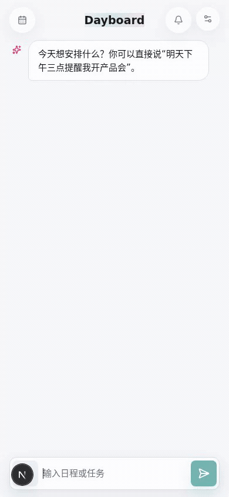
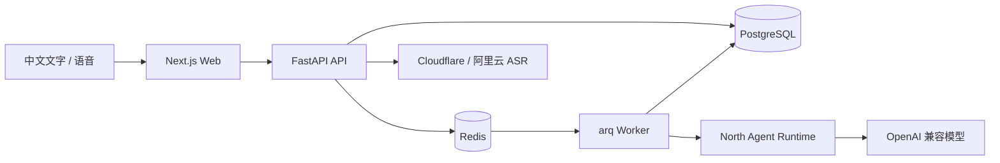

# Dayboard

**会理解中文上下文、修改前先找准目标的 AI 日程助手。**

不用逐项填写日期、时间和参与人。直接说出你的安排，Dayboard 会把它变成可以查看、
继续修改的日程或待办。需要调整时，你也可以接着说“把刚才的会议改到四点”。
如果修改目标不唯一，它会让你选择，而不是随便改一项。

[在线体验](https://dayboard.selfapi.art) · [查看使用示例](#可以这样说)

<p align="center">
  
</p>

<p align="center"><strong>一句话创建日程，再用上下文完成改期。</strong></p>

> Dayboard 正在持续开发，当前优先服务中文和北京时间场景，尚未发布稳定版本。

## 它能做什么

- **直接说出安排**：用中文创建、查询、改期或取消日程，不必先理解日历表单。
- **接着上一句修改**：识别“刚才的会议”“明天下午的评审”等上下文目标。
- **不随便修改**：修改前先查询已有数据；匹配多项时展示候选项，由你决定改哪一个。
- **区分日程与待办**：有明确日期或时间的安排进入日历，没有时间锚点的行动进入待办清单。
- **支持文字和语音**：移动端可以键入命令，也可以按住说话后直接提交。
- **随时查看结果**：对话旁边保留可检查的日视图，创建和修改会同步显示。

## 可以这样说

```text
下周五下午三点和张总开会，两个小时
把刚才的会议改到四点

下班后拿快递，再买一瓶洗衣液
把拿快递安排到明天下午三点

查一下这周五有什么安排
取消明天下午的产品评审
```

Dayboard 会把自然语言转换为结构化日程或待办。修改操作会先查询真实数据，
不依赖前端关键词拼接，也不会在找不到目标时偷偷创建一个替代项。

## 灵感

Dayboard 对清晰日视图和弹性日常规划的关注，受到
[Tiimo](https://www.tiimoapp.com/) 的启发。Dayboard 是独立的开源项目，与 Tiimo 无隶属关系。

---

## 开发者入口

> [!IMPORTANT]
> **AI 编码助手：不要把本 README 当作系统实现规范。** 开始修改前先完整阅读
> [`AGENTS.md`](./AGENTS.md)，再从 [`docs/README.md`](./docs/README.md) 按任务类型进入所需文档。
> `docs/current/` 是当前系统事实的唯一完整来源；`docs/archive/` 只保存历史，不得指导实现。

开发者也应从[文档索引](./docs/README.md)开始，而不是一次读完所有文档：

- [当前实现](./docs/current/README.md)：架构、模块、产品模型、Run 生命周期和时间协议。
- [工程规范](./docs/engineering-guidelines.md)：代码边界、测试策略和安全要求。
- [UI 设计基线](./docs/ui-design.md)：移动端视觉与交互规则。
- [部署指南](./docs/deploy.md)：生产构建、发布、回滚和健康检查。
- [当前进度](./docs/PROJECT_STATE.md)：版本、下一里程碑、已知问题和发布检查。

## 技术概览

Dayboard 是产品层，负责账号、对话、日程、待办、提醒、语音和用户界面。
可复用的 Agent 构建、运行与工具编排能力由
[`north`](https://github.com/Notryag/north-agent) 提供。


```mermaid
flowchart LR
    User["中文文字 / 语音"] --> Web["Next.js Web"]
    Web --> API["FastAPI API"]
    API --> PG[(PostgreSQL)]
    API --> Redis[(Redis)]
    Redis --> Worker["arq Worker"]
    Worker --> North["North Agent Runtime"]
    North --> Model["OpenAI 兼容模型"]
    Worker --> PG
    API --> ASR["Cloudflare / 阿里云 ASR"]
```

| 层级 | 技术 |
| --- | --- |
| Web | Next.js 16、React 19、TypeScript、CSS Modules |
| API | FastAPI、Pydantic、SQLAlchemy、Alembic |
| Agent | North、OpenAI 兼容模型接口 |
| 异步任务 | arq、Redis |
| 数据库 | PostgreSQL 17 |
| 语音识别 | Cloudflare Workers AI、阿里云 ASR |
| 部署 | Docker Compose、Nginx |

## 本地运行

### 前置条件

- Docker 与 Docker Compose
- Node.js 22
- 一个 OpenAI 兼容模型接口及 API Key
- 可选：Cloudflare Workers AI 或阿里云 ASR 凭据

### 1. 准备配置

```bash
git clone https://github.com/Notryag/dayboard.git
cd dayboard
cp .env.example .env
```

至少在 `.env` 中配置模型：

```dotenv
APP_MODEL_NAME=openai:gpt-4o-mini
OPENAI_API_KEY=your-api-key
# 使用兼容网关时填写；直接使用 OpenAI 时可留空
OPENAI_BASE_URL=
```

语音输入是可选能力。启用时再填写 `.env.example` 中对应 ASR 供应商的配置。
真实密钥只能放在 `.env` 或密钥管理服务中，不要提交到 Git。

通过 Northgate 做小流量验证时，可以保留原供应商连接，并额外设置
`DAYBOARD_NORTHGATE_BASE_URL`、`DAYBOARD_NORTHGATE_APPLICATION_KEY` 和
`DAYBOARD_NORTHGATE_CANARY_USER_IDS`。具体步骤见[部署指南](./docs/deploy.md)。

### 2. 启动后端

API 容器启动时会自动执行数据库迁移：

```bash
docker compose up -d --build postgres redis api worker
docker compose ps
curl http://127.0.0.1:8000/health
```

### 3. 启动 Web

```bash
cd apps/web
npm ci
NEXT_PUBLIC_DAYBOARD_API_BASE_URL=http://127.0.0.1:8000 \
NEXT_PUBLIC_DAYBOARD_BASE_PATH= \
npm run dev
```

打开 <http://localhost:3000>，注册一个本地账号即可开始使用。生产环境请使用
Docker Compose 和 Nginx，具体流程见[部署指南](./docs/deploy.md)。

## 仓库结构

```text
apps/api/                 FastAPI、Agent、领域服务、Worker、Alembic
apps/web/                 Next.js Web 应用
deploy/                   Nginx、备份脚本和 systemd 定时任务
docs/                     当前事实、工程指南、ADR 与历史文档
packages/agent-platform/  可复用的应用层 Agent 能力
docker-compose.yml        PostgreSQL、Redis、API、Worker、Web
```

## 开发与贡献

普通改动执行最小范围检查，完整测试留给大版本和高风险变更。提交代码前遵循
[`AGENTS.md`](./AGENTS.md) 和[工程规范](./docs/engineering-guidelines.md)。问题与建议可以通过
[GitHub Issues](https://github.com/Notryag/dayboard/issues) 提交。

## 许可证

Dayboard 基于 [MIT License](./LICENSE) 开源。
