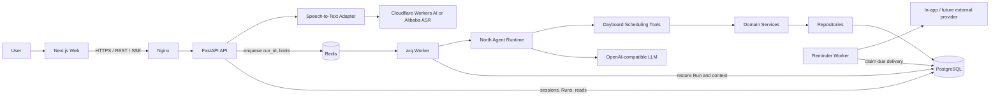
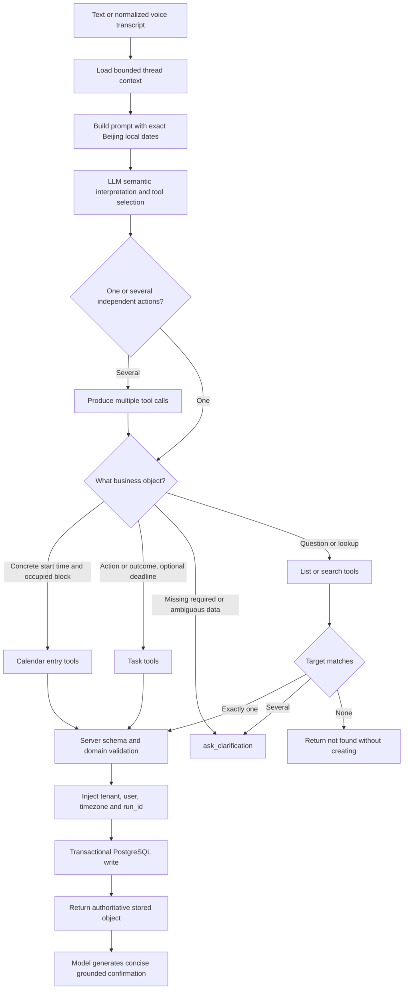
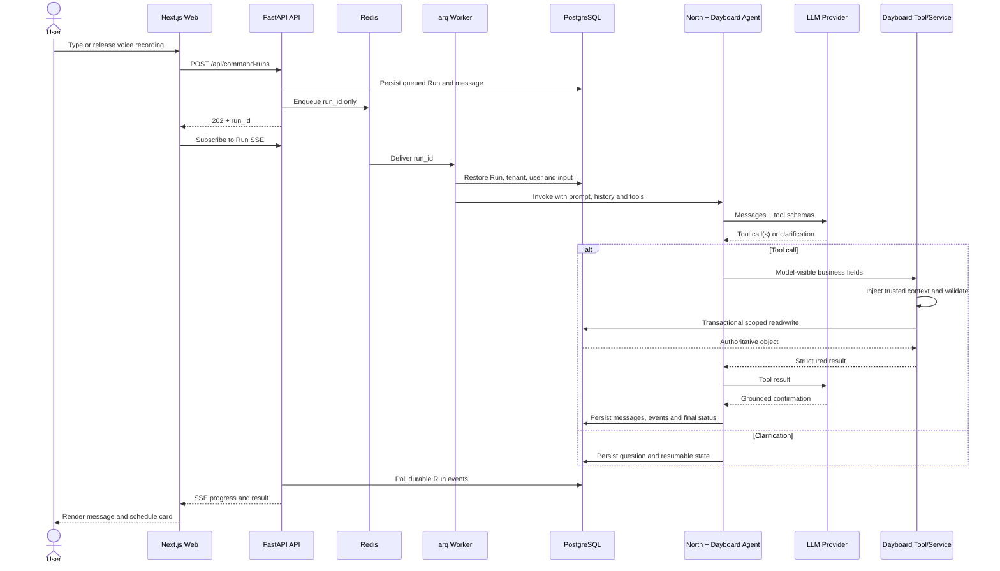

# Architecture

## Layering

Dayboard should follow this direction:

```text
Next.js web app
  -> Dayboard HTTP API / SSE API
  -> Dayboard application services
  -> north runtime: agent loop, tool execution, thread state, runtime events
  -> Dayboard tools
  -> Dayboard domain services
  -> repositories
  -> PostgreSQL
```

Supporting infrastructure:

```text
Redis or Valkey
  -> job queue
  -> short-lived locks and rate limits

S3-compatible object storage
  -> voice audio
  -> future attachments
```

The current SSE implementation reads durable Run events from PostgreSQL every 500 ms. Redis stream
fanout is a future scale optimization, not part of the current request path. PostgreSQL remains the
event source of truth before and after fanout is introduced.

## System Overview

The following diagram is the current production-shaped component map. API and Worker are separate
processes built from the same backend codebase: API owns short-lived HTTP boundaries, while Worker
owns long-running Agent execution.



Important module boundaries:

| Module | Owns | Does not own |
| --- | --- | --- |
| Web | recording gestures, chat/day-view presentation, REST/SSE clients | intent rules, tenant identity, timezone decisions |
| API | authentication, validation, rate limits, durable Run creation, reads and direct UI mutations | long-running Agent execution |
| Worker | queued Run lifecycle, Agent invocation, runtime event persistence | HTTP sessions or browser state |
| North | generic Agent loop, model/tool execution, checkpoints and runtime events | Dayboard calendar/task business rules |
| Dayboard Agent | system prompt, installed product tools, conversation context | trusted identity or direct database access from model output |
| Domain services | deterministic validation, authorization scope, concurrency and transactions | natural-language interpretation |
| PostgreSQL | durable product and Run source of truth | queue delivery or transient limits |
| Redis | queue, rate limits and short-lived coordination | authoritative business state |

## Responsibility Split

### Dayboard

- Next.js web app
- API and SSE endpoints
- product-specific configuration
- tenant and user context
- calendar and task schemas
- `CalendarEntry` and `TaskItem` storage
- scheduling tools
- clarification policy for schedule creation
- voice upload and ASR provider integration
- UI-facing response shaping

### North

- reusable agent runtime
- agent creation
- streamed runtime execution
- reusable tool and skill infrastructure
- thread state and artifact protocols
- runtime events such as `StreamEvent` and `RunEvent`

### Model Providers

- LLM APIs used by `north`
- later ASR APIs used by Dayboard input services

Model provider credentials must come from environment variables or a secret store, not code or committed files. Dayboard should support OpenAI-compatible gateways through:

```text
APP_MODEL_NAME
OPENAI_BASE_URL
OPENAI_API_KEY
DAYBOARD_NORTHGATE_METADATA_ENABLED
DAYBOARD_NORTHGATE_BASE_URL
DAYBOARD_NORTHGATE_APPLICATION_KEY
DAYBOARD_NORTHGATE_CANARY_TENANT_IDS
```

Real values belong in `.env`, which is ignored by git. `.env.example` should contain only empty placeholders or safe defaults.

When `OPENAI_BASE_URL` points to Northgate, enable
`DAYBOARD_NORTHGATE_METADATA_ENABLED`. Dayboard then binds trusted `tenant_id`,
`user_id`, and `run_id` to the model client's `Northgate-Metadata` header for
usage attribution. The browser, model input, and queued job cannot supply or
override these values.

For a bounded rollout, keep the original `OPENAI_BASE_URL` and `OPENAI_API_KEY`
as the default connection and configure the separate Northgate URL, application
key, and comma-separated tenant UUID allowlist. Agent construction selects the
Northgate connection only when the trusted tenant ID is in that allowlist. Other
tenants retain the original model connection and receive no Northgate header.

## Technology Choices

- Frontend: Next.js, React, TypeScript
- UI primitives/components: shadcn/ui on Radix UI as the first candidate
- Frontend server state: TanStack Query as the first candidate when API usage grows
- Frontend shared client state: Zustand or Jotai when local React state is insufficient
- Icons: lucide-react
- Backend: FastAPI, Pydantic, SQLAlchemy 2.x, Alembic
- Agent runtime: `north` pinned to a `north-agent` Git commit for reproducible installs, with an
  editable sibling checkout used only while developing both repositories together
- Database: PostgreSQL
- Queue/cache/stream fanout: Redis or Valkey
- Worker: `arq` with Redis
- API contract: OpenAPI generated from FastAPI, then consumed by the web app
- Object storage: S3-compatible storage for audio and future attachments
- Observability: structured JSON logs with `structlog` first, OpenTelemetry later
- Rate limiting: edge/gateway first when deployed, FastAPI middleware as the application boundary, provider-level budgets before LLM calls

## Project Shape

The target repository layout should keep product code, frontend code, and shared generated clients separate:

```text
dayboard/
  apps/
    api/
      dayboard/
        api/
        app/
        agent/
        domain/
        tools/
        db/
        workers/
        integrations/
    web/
      app/
      components/
      features/
      lib/
  packages/
    client/
    schemas/
  docs/
```

Backend package responsibilities:

- `dayboard.api`: HTTP routes, SSE routes, request/response schemas
- `dayboard.app`: application services and use cases
- `dayboard.agent`: `build_dayboard_agent` and north integration
- `dayboard.domain`: `CalendarEntry`, `TaskItem`, policies, validation
- `dayboard.tools`: tools exposed to the agent
- `dayboard.db`: SQLAlchemy models, repositories, sessions, migrations
- `dayboard.workers`: agent run jobs and future ASR jobs
- `dayboard.integrations`: ASR, object storage, external calendar sync later

## Network To Database Flow

Text command flow:

```text
Client
  -> POST /api/command-runs
  -> API validates request and resolves TenantContext
  -> application service persists a queued agent_run and returns 202
  -> API enqueues an arq job in Redis containing only the run_id
  -> arq worker opens an independent database session
  -> worker restores tenant, owner, and input text from agent_runs, then runs north
  -> north calls Dayboard tools
  -> tool calls Dayboard domain service
  -> repository commits PostgreSQL before a successful ToolMessage is exposed
  -> north streams canonical message chunks to the Dayboard projector
  -> worker publishes safe presentation events to a per-Run Redis Stream
  -> worker persists typed parts in assistant conversation message metadata
  -> client joins the Run SSE stream and reduces text deltas and ToolMessages
```

Clarification flow:

```text
user text
  -> agent detects missing required scheduling data
  -> ask_clarification tool interrupts the run
  -> agent_run status becomes needs_clarification
  -> SSE emits the question
  -> user answers on the same thread
  -> worker resumes the agent run
```

Voice flow:

```text
Browser MediaRecorder
  -> authenticated multipart upload
  -> MIME, byte-size, and isolated PyAV duration validation
  -> ASR provider
  -> voice_transcripts row
  -> normalized transcript text
  -> normal command flow automatically after release-to-send
```

Short command audio is processed synchronously and discarded after the provider call. Dayboard does
not persist raw audio. Object storage and queued transcription remain options for future long-form
audio, but are not part of the short scheduling-command path.

Speech recognition is provider-neutral inside Dayboard. `SpeechToTextProvider` accepts validated
audio plus optional language and vocabulary hints and returns a normalized `Transcript`. Deployment
selects a provider through `DAYBOARD_ASR_PROVIDER`. The production adapter calls Cloudflare Workers
AI `@cf/openai/whisper-large-v3-turbo` through its REST API with Base64 audio; the Alibaba Cloud
Model Studio `qwen3-asr-flash` adapter remains available as an alternate China-region provider.
Provider credentials, request signatures, and raw response formats remain inside
`dayboard.integrations.speech`. Adding Volcengine, Tencent Cloud, or an on-premise adapter must not
change Dayboard's public upload API or transcript domain model.

## Intent Recognition And Tool Selection

Dayboard does not maintain a separate keyword classifier that first labels input as
`create_calendar`, `create_task`, or `reschedule`. Intent recognition happens inside the Agent's
model tool-calling turn. The model receives four controlled inputs:

1. the current user message or normalized voice transcript;
2. bounded conversation history and any persisted compaction summary;
3. a server-built system prompt containing exact local dates and scheduling policy;
4. model-visible tool names, descriptions, and JSON schemas.

The model uses meaning and context to choose one or more tools. Tool schemas constrain the shape of
its proposal; trusted server context and domain services then validate and execute it. The model is
therefore responsible for semantic interpretation, but it is never the authority for user identity,
timezone, database ownership, optimistic concurrency, idempotency, or final stored values.



Current semantic policy examples:

| User meaning | Agent route |
| --- | --- |
| "明天下午三点游泳一小时" | `create_calendar_entry`: concrete time block |
| "等会儿拿快递" | `create_task_item`: undated completion action |
| "明天下午五点前交报告" | `create_task_item`: task with an exact deadline |
| "把游泳改到下午四点" | search calendar first, then reschedule one match |
| "买菜做完了" | search task first, then update one match to completed |
| "安排一个会议" | `ask_clarification`: calendar start time is required |

This policy currently lives in `dayboard.agent.prompts`, while model-visible schemas and trusted
closure injection live in `dayboard.agent.tools`. Deterministic rules such as timezone resolution,
default one-hour duration, conflict checks, reminders, tenant filtering, idempotency, and optimistic
concurrency live below the Agent in application/domain services.

## Command Execution Sequence



## API Surface

Phase 1 API:

```text
POST /api/command-runs
GET  /api/runs/{run_id}
GET  /api/runs/{run_id}/events
GET  /api/runs/{run_id}/events/stream
GET  /api/calendar-entries
GET  /api/task-items
```

The calendar and task collection endpoints are implemented as tenant-scoped, keyset-paginated
read models. Calendar queries accept trusted-product-timezone `period=today|tomorrow`, product-local
`date`, or explicit `from` and `to`, plus `limit` and `cursor`; task queries accept product-local
`date`, `status`, `due_kind`, `due_from`, `due_to`, `limit`, and `cursor`. The server resolves local
dates with the authenticated account timezone. Responses expose UI-relevant schedule fields and Run
correlation without exposing tenant ids or internal idempotency operation keys.

`agent_runs` and `agent_run_events` are the source of truth for command execution state. Command creation and execution are separate operations: the request transaction commits the queued run before enqueueing an arq job. The Redis queue provides cross-process delivery, while each worker opens an independent database session. Jobs use the run id as their unique queue id and re-check PostgreSQL state before execution because arq uses at-least-once delivery.

Redis Streams transport live canonical-message projections between Worker and API processes. They
are bounded, expiring fanout infrastructure rather than product truth. The SSE cursor uses the Redis
stream entry ID. If a live terminal event is unavailable, the endpoint emits the terminal state from
PostgreSQL. Historical schedule cards are restored from typed assistant message metadata, not by
querying mutable calendar or task rows using `created_by_run_id`.

The worker periodically recovers abandoned active runs. A `running` run uses its last update time and a shorter execution timeout; a `queued` run uses its creation time and a longer queue-wait timeout. Recovery uses atomic, status-specific transitions (`queued -> failed` or `running -> failed`), so a job that starts while recovery is scanning cannot be mistaken for an abandoned queued job. A delayed Redis job that arrives after recovery exits immediately after observing the terminal PostgreSQL state.

Structured clarification is persisted in `conversation_states` and delivered as part of the existing clarification lifecycle. The agent decides that business information is ambiguous and supplies relevant candidates; Dayboard validates and persists those candidates, exposes only stable option keys plus display data to the frontend, and keeps database ids and optimistic-lock versions server-side. A choice response contains the state version and option key. Dayboard resolves that key to trusted context, creates a normal follow-up run on the same thread, and continues observability through the existing run-event SSE stream. Visual component names and UI-library models must not enter this backend contract.

A command or future voice transcript may contain multiple distinct scheduling instructions. Create-tool idempotency is scoped to `(tenant_id, run_id, operation_key)`, where Dayboard derives `operation_key` from the normalized server-side tool input. Repeating the same tool call in a retried run step returns the original object, while different calendar entries or tasks in the same run are persisted independently. The model never supplies this key.

Calendar rescheduling, calendar cancellation, and task updates use the same server-derived
per-operation identity. This permits multiple distinct mutations in one Run while a retry
of an identical tool call resolves to the object changed by the original operation.

North normalizes token usage for every observed model call and aggregates it by call ID.
Dayboard owns durable usage records, tenant/user attribution, pricing, admission budgets,
and later reconciliation. Run finalization settles normalized usage through an independent
database session for success, clarification, failure, interruption, and cancellation. A unique
`(tenant_id, run_id)` index plus immutable insert-once settlement provides one aggregate record
and one budget reconciliation across retries; settlement failure is logged without replacing
the Run outcome.
See [ADR-004](./adr/004-adopt-callback-first-token-accounting.md) for the ownership model,
current implementation boundary, and finalization requirements.

Runtime callback events use an independent short-lived database session rather than the Agent's
business-tool session. A per-Run async lock serializes callback writes so parallel tool calls do
not concurrently operate on one SQLAlchemy session or race event sequence allocation.

Scheduling tools within one Agent Run are serialized at the Dayboard tool assembly boundary
because they share one business `AsyncSession`. LangGraph may dispatch tool calls concurrently,
but short PostgreSQL scheduling operations execute in model order to preserve session safety,
idempotency, and audit semantics. Future slow external tools require their own concurrency and
session boundary instead of bypassing this lock.

## Reminder Delivery

Reminder intent remains attached to its calendar entry or task. A separate PostgreSQL
`reminder_deliveries` outbox stores the resolved delivery instant and operational state:

```text
business-object write
  -> validate fixed ISO 8601 offset
  -> cancel the previous pending source/channel delivery
  -> insert the replacement delivery in the same transaction
  -> worker claims due rows with FOR UPDATE SKIP LOCKED
  -> provider acknowledgement
  -> delivered or explicit retry/failure state
```

Calendar reminders are anchored to `start_time`; task reminders are normalized to `due_at`.
An offset of `PT0M` means delivery at the anchor time. The tool boundary also normalizes common
model shorthand such as `0m`, `10m`, `1h`, and `1d` into canonical ISO 8601 durations.
Rescheduling replaces a pending delivery, while calendar cancellation and task completion or
cancellation cancel it. Delivery rows are tenant and owner scoped. The first `in_app` provider
proves scheduling, idempotency, status, and observability without an external network dependency.
Future Alibaba Cloud SMS, WeChat, or email adapters reuse this outbox and must use the delivery ID
as their provider idempotency key where supported.

Current supporting API:

```text
POST /api/voice/transcriptions
GET  /api/voice/transcriptions/{transcript_id}
GET  /api/reminders
```

Planned direct object API:

```text
POST /api/calendar-entries
PATCH /api/calendar-entries/{entry_id}
DELETE /api/calendar-entries/{entry_id}
POST /api/task-items
PATCH /api/task-items/{task_id}
DELETE /api/task-items/{task_id}
```

`POST /api/command-runs` supports idempotent retries with an `Idempotency-Key` header.

## Account Recovery

Email remains optional at registration. Accounts with a bound email can use self-service password
recovery; accounts without one require a future authenticated email-binding or support process.

```text
POST /api/auth/password-reset/request
  -> always return the same 202 response
  -> lock the matching active user when one exists
  -> delete previous reset tokens for that user
  -> store only SHA-256(token), never the raw token
  -> send the raw token in a configured public-web reset link through the SMTP adapter

POST /api/auth/password-reset/confirm
  -> lock and validate an unused, unexpired token
  -> replace the Argon2id password hash
  -> consume every outstanding reset token for the user
  -> revoke every existing login session
  -> require a fresh login
```

Unknown emails and accounts without email receive the same `202` response as a known account.
Globally unavailable mail configuration returns the same `503` for every address, so the UI can be
honest without revealing account existence. `GET /api/auth/capabilities` controls whether the web
client renders the recovery entry point; token confirmation remains available independently of mail
delivery. Reset-request and reset-confirm endpoints have separate IP rate limits. SMTP credentials
and the canonical public web URL are server configuration; the request `Host` header is never used
to construct the reset link. The mail adapter sends a plain text message so the link remains usable
across conservative email clients.

## Rate Limiting

Rate limiting belongs at multiple layers:

```text
edge/CDN/API gateway
  -> coarse public traffic protection
FastAPI middleware
  -> tenant/user/IP request protection
agent/model provider boundary
  -> LLM request and token budgets
```

The first application implementation uses FastAPI middleware backed by Redis or Valkey. This keeps limits shared across API processes. In-process memory limits are acceptable only for local development or tests.

Initial keying:

- use client address in HTTP middleware before authentication resolution;
- use trusted `tenant_id` and user id only after server-side session resolution;
- never use caller-supplied tenant or user headers as an identity or rate-limit key.

Later, `/api/command-runs`, voice upload, and provider calls should each have separate limits because their cost profiles are different.

Provider budgets are application/business controls and belong in code, not only
at the gateway. The gateway cannot reliably know which command will call a
model, which model will be used, how many agent turns will run, or which tenant
plan should be charged. Dayboard should check provider budgets immediately
before real model calls.

Initial provider budget controls:

- request budget by tenant, user, and model
- estimated token budget by tenant, user, and model
- shared Redis or Valkey storage in server environments
- memory storage only for tests or local isolated development

The token budget reserves a cheap prompt-size estimate before invocation. The first immutable
usage settlement charges any positive actual-versus-estimated difference exactly once. It does
not refund a negative difference across fixed windows. PostgreSQL records provider-reported
input/output tokens with `tenant_id`, `user_id`, `run_id`, and model as the actual usage source
of truth.

## Agent Assembly Boundary

Dayboard owns the product assembly function. `north` should expose generic runtime primitives, while Dayboard decides which tools, prompts, context, and clarification rules are installed.

The first implementation uses local LangChain/north tool injection, not MCP.
MCP can be considered later if Dayboard tools need to be exposed to other
products or deployed as an external tool service. For now the tools are
application-internal because they need Dayboard database sessions, tenant
context, run identity, and domain services.

The implementation should look conceptually like:

```python
tools = build_scheduling_tools(
    session=session,
    context=tenant_context,
    run_id=run_id,
)

agent = build_dayboard_agent(
    settings=settings,
    tools=tools,
)
```

This keeps product behavior in Dayboard and avoids adding Dayboard-specific assumptions to `north`.

The same injection boundary applies to slow or remote tools. A future knowledge-search tool remains
a Dayboard tool with an independent client/session lifecycle; North only executes it. Embeddings,
document ownership, credentials, tenant filtering, and authorization stay in Dayboard or its
external knowledge service. See
[ADR-006](./adr/006-tenant-isolation-and-external-tools.md).

The model-visible tool schemas must only contain business fields. Trusted
fields are injected by server closures and must not be exposed to the model:

```text
model-visible fields:
  title, local_start, local_end, start_date, end_date, participants, reminder,
  due_local, status, expected_updated_at

server-injected fields:
  session, tenant_id, user_id, timezone, run_id, request_id, permissions
```

Agent assembly rejects a tool whose model-visible schema exposes trusted context fields. This is a
runtime guard against accidentally turning model output into an authorization decision.

Dayboard should keep the command application service as the product boundary:

```text
CommandService
  -> north.invoke_agent_once
```

`CommandService` owns queued run creation and execution of an existing Dayboard run. The execution path checks provider budgets, injects Dayboard scheduling tools into `north`, invokes the agent through north's generic one-shot helper, and maps completion or clarification back into Dayboard run events. The Gateway owns Redis enqueueing and arq owns worker task lifetime; workers own database-session isolation. Tests may inject a fake service, dispatcher, or model invoker, but product runtime must not keep a parallel synchronous interpretation path.

### DeerFlow Reference Boundary

Evolution of `north` should use `/root/deer-flow` as its primary implementation reference. The most relevant reusable patterns are:

- configuration-driven model construction with provider adapters and OpenAI-compatible gateway normalization
- middleware with equivalent synchronous and asynchronous execution paths
- a run manager separated from persisted event storage and stream fanout
- explicit create, stream, join, wait, cancel, message, and event contracts for runs

These patterns should be reduced to reusable runtime interfaces in `north`. DeerFlow's FastAPI Gateway, authentication, authorization, thread ownership, and application persistence remain application-layer concerns and should not become dependencies of `north`. Dayboard owns its tenant context, PostgreSQL records, scheduling tools, and public product API even when its run API follows DeerFlow semantics.

The model must not generate trusted context fields. The server injects them:

- `tenant_id`
- `user_id`
- `timezone`
- `locale`
- `run_id`
- `thread_id`
- `request_id`

Model-visible scheduling datetimes are local values without `Z` or numeric offsets. Dayboard
resolves them with `TenantContext.timezone` before calling domain services. The current product
configuration is `Asia/Shanghai`; retaining the context field allows a future trusted tenant setting
without changing Agent tool contracts. Browser-detected registration timezones are not trusted for
scheduling.

## Product Tools

Initial tools:

- `create_calendar_entry`
- `list_calendar_entries`
- `search_calendar_entries`
- `reschedule_calendar_entry`
- `create_task_item`
- `list_task_items`
- `search_task_items`
- `update_task_item`

Later tools:

- `update_calendar_entry`
- `delete_calendar_entry`

Task completion and cancellation are status transitions through `update_task_item`, not
hard deletion. Business objects remain available for history and audit.

These tools live in Dayboard unless they prove broadly reusable across products.

## Create Calendar Entry Flow

Creating a calendar entry should call a Dayboard tool directly. There is no intermediate `north` business event.

```text
user text
  -> north agent reads tool schemas
  -> agent calls create_calendar_entry when fields are available
  -> agent asks clarification when required fields are missing
  -> create_calendar_entry validates input
  -> CalendarService creates CalendarEntry
  -> CalendarRepository writes PostgreSQL
  -> tool returns created entry id and display summary
```

Example:

```text
Input: Next Wednesday at 3pm, schedule a product review with Alice and remind me one day before.

Tool call:
  create_calendar_entry(
    title="product review",
    local_start="2026-07-15T15:00:00",
    participants=["Alice"],
    reminder={"offset": "P1D", "anchor": "start_time"}
  )
```

If the user says "Schedule a product review with Alice", Dayboard should ask for the missing time before calling `create_calendar_entry`.

## Data Ownership

`north` runtime data:

- thread state
- runtime stream events
- run events
- tool call traces
- artifacts

Dayboard business data:

- calendar entries
- task items
- reminders
- voice transcripts
- user profiles
- audit attribution on business objects and Runs

`CalendarEntry` should never be added to `north` state as a core runtime concept. A tool result may reference a `calendar_entry_id`.

## Database Model

PostgreSQL is the source of truth. Redis or Valkey is not a source of truth.

Core tables:

```text
tenants
users
user_credentials
external_identities
tenant_memberships
user_profiles
user_sessions
password_reset_tokens
calendar_entries
task_items
reminder_deliveries
conversation_threads
conversation_messages
conversation_states
agent_runs
agent_run_events
voice_transcripts
idempotency_keys
provider_usage_records
```

Local development and controlled demos may use one configured identity. Password mode resolves
tenant and owner identity from a server-side session and active membership.

Required common fields:

```text
tenant_id
created_at
updated_at
deleted_at
```

Business tables should also include:

```text
owner_user_id
created_by_run_id
updated_by_run_id
```

Useful initial indexes:

```text
calendar_entries(tenant_id, owner_user_id, start_time)
calendar_entries(tenant_id, start_time)
calendar_entries(tenant_id, created_by_run_id)
task_items(tenant_id, owner_user_id, status, due_at)
agent_runs(tenant_id, thread_id, created_at)
agent_run_events(tenant_id, run_id, seq)
idempotency_keys(tenant_id, key)
```

## Tenant Extensibility

Phase 1 does not need full tenant administration or dedicated databases, but the code should pass a `TenantContext` through services and tools.

```text
TenantContext:
  tenant_id
  user_id
  timezone
  locale
  isolation_mode
```

Default mode:

```text
isolation_mode = shared
database = main PostgreSQL
queries include tenant_id
```

Future enterprise modes:

```text
isolation_mode = dedicated_schema
isolation_mode = dedicated_database
isolation_mode = dedicated_cluster
```

Keep `tenant_id` in tables even when a future tenant uses a dedicated database. It makes migrations, exports, audit, and mixed deployments simpler.

## Concurrency And Reliability

- API requests should create durable `agent_runs` before background execution starts.
- Agent execution should happen in workers, not inside long blocking HTTP requests.
- Tool writes should be transactional.
- Command creation should support idempotency keys.
- Run status should be explicit: `queued`, `running`, `needs_clarification`, `completed`, `failed`, `cancelled`.
- Run status transitions should be atomic and terminal states must never be overwritten by late workers or cancellation requests.
- Long-running run output should be delivered over SSE and recoverable from persisted run events.
- Redis or Valkey can provide queueing, fanout, locks, and rate limits, but PostgreSQL remains the durable source.

## Integration Principle

Dayboard should inject its own:

- tenant context
- data stores
- default prompts
- scheduling tools
- clarification rules

It should not fork the `north` runtime unless a reusable capability is missing.
