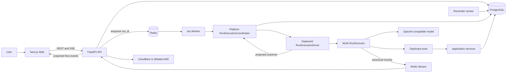

# Current Architecture

This document describes the system implemented on `main`. It does not describe historical phases
or speculative replacements. Run transport details live in [run-lifecycle.md](./run-lifecycle.md),
and product semantics live in [product-model.md](./product-model.md).

## System Map



PostgreSQL is the source of truth for accounts, schedules, conversations, Runs, durable Run events,
reminders, and provider usage. Redis owns queue delivery, rate limits, coordination, and bounded
live StreamBridge replay. Redis is not authoritative product storage.
Conversation bootstrap resolves the owner's primary Thread from PostgreSQL; browser-local state
cannot create a separate history boundary across devices.
The primary Thread is protected by a partial unique database index. Conversation messages use
cursor pagination rather than an unbounded history response; PostgreSQL remains authoritative on
refresh and across devices.
Thread lifecycle and role are orthogonal: `status` is the constrained `active | archived`
lifecycle, while `is_primary` identifies the owner's single product conversation. Non-primary
evaluation Threads are active lifecycle records rather than a third pseudo-status. New Runs require
an active Thread; archived history remains readable but cannot accept new commands.

## Ownership

| Boundary | Owns | Must not own |
| --- | --- | --- |
| Web | authenticated presentation, recording gestures, REST/SSE clients | intent policy, trusted identity, persistence |
| FastAPI | auth, validation, tenant context, direct reads/writes, Run creation, SSE framing | long-running Agent execution |
| Worker | queued job execution, dependency composition, stale-Run recovery, reminder delivery | browser sessions |
| North | generic Agent loop, model/tool execution, canonical runtime streaming | Dayboard product concepts |
| Agent Platform | identity, Conversation/Run contracts, lifecycle coordination, persistence ports | North or scheduling concepts |
| Dayboard Agent | prompt, seven scheduling tools, North adapter, safe result projection | tenant identity or direct model-authorized writes |
| Services/repositories | deterministic rules, scoped transactions, optimistic concurrency | natural-language interpretation |
| PostgreSQL | durable product and execution state | queue delivery or live fanout |
| Redis | arq queue, rate limits, locks, Redis Streams | durable product truth |

Agent Platform and North are independent lower-level capabilities; neither imports the other.
Dayboard depends on both and bridges them through a Dayboard-owned adapter implementing the
Platform `RunExecutionDriver` port. Runtime callbacks and results flow through declared interfaces
without reversing source dependencies. North does not understand application identity or
persistence; Agent Platform does not understand North events, calendars, tasks, scheduling prompts,
or the Dayboard UI.

## Backend Shape

The reusable application package currently owns shared identity and Conversation/Run contracts:

```text
agent_platform.core          identity, Conversation/Run, Interaction, Presentation, execution outcome
agent_platform.ports         persistence-neutral stores, Unit of Work, Run execution driver
agent_platform.application   Conversation/Run lifecycle, submission, idempotency, execution coordinator
```

The Dayboard API package is split by responsibility:

```text
dayboard.api           HTTP, SSE, request and response schemas
dayboard.app           product use cases, North execution adapter, result projection
dayboard.composition   outer process wiring for application services and database adapters
dayboard.agent         prompt, North assembly, presentation projection
dayboard.domain        product models and deterministic validation
dayboard.tools         thin Agent-facing adapters
dayboard.db            SQLAlchemy models, repositories, sessions
dayboard.workers       arq Run and reminder jobs
dayboard.integrations  ASR and external provider adapters
```

Trusted `TenantContext` is resolved from the authenticated server session. Tenant, owner, timezone,
thread, Run, operation keys, and permissions are injected by the runtime and never exposed as
model-supplied tool arguments. Repository queries scope business data by tenant and owner.

Dayboard's composition root connects platform Conversation and Run services to PostgreSQL adapters.
The platform owns persistence use cases, paging, state transitions and lifecycle event policy; the
adapters own SQLAlchemy rows, constraint translation, tenant-scoped queries, and individual database
operations. Dayboard's clarification service owns scheduling candidate validation, local-time
projection, public state filtering, and user-facing choice text.

Dayboard scheduling has a separate product-owned Unit of Work. `SchedulingService` and
`ScheduleQueryService` depend only on scheduling store ports and domain objects; SQLAlchemy row
mapping stays in `dayboard.db`. Calendar/task writes and the corresponding Reminder Outbox
replacement share one `AsyncSession` through `SqlAlchemySchedulingUnitOfWork`. The application
service never commits. The API commits after a complete direct mutation, while the serialized Agent
tool boundary commits only after its receipt and presentation artifact have been built; either
boundary rolls the whole transaction back on failure. There is no `SchedulingService(session)`
compatibility constructor.

Reminder inbox and delivery processing use a separate product-owned Unit of Work. The application
service depends on delivery and source-projection ports and receives domain snapshots rather than
SQLAlchemy rows; `dayboard.composition` wires those ports to the SQLAlchemy Unit of Work for API and
Worker processes. API mutations and the Worker own the commit boundary. Due processing first reads
candidate deliveries, locks their tenant/owner-scoped source rows in stable order, and only then
claims still-due Reminder rows. This matches Scheduling's source-then-delivery lock order and makes
concurrent rescheduling linearizable rather than mixing an old reminder with an uncommitted new
source. Source checking plus transitions to `delivered`, `expired`, or `cancelled` happen in one
short database transaction. No transaction is held across an external notification provider; a
future Web Push adapter must commit the claim before network delivery and finalize the result in a
second transaction. Queue-only states are not exposed as inbox entries.

Voice transcription uses its own product-owned Unit of Work and an application-owned ASR provider
port. The application service first commits a tenant/owner-scoped `processing` transcript, calls the
external provider without an open database transaction, and then commits exactly one terminal
`completed` or `failed` transition. Terminal updates lock and match only rows that are still
`processing`; repository adapters return domain transcripts and keep ORM rows plus provider request
metadata inside `dayboard.db`. `dayboard.composition.voice` is the only module that connects the
application service to the SQLAlchemy Unit of Work.

Account Recovery uses a separate Dayboard-owned Unit of Work because credentials and reset tokens
are global user identity data rather than tenant-scoped scheduling records. The application service
owns CSPRNG token generation, SHA-256 token digests, password-hasher orchestration, and expiry
policy, but it never imports SQLAlchemy or commits. The API commits token issue or successful
consumption before scheduling email delivery or deleting the browser cookie. Repository operations
serialize by locking `UserRow` first, then revalidate and lock reset tokens and credentials. Login
uses the same User-row gate before reading the current password hash and creating a Session, so a
concurrent reset either rejects the old password or revokes the Session created immediately before
it. Password update, all unused-token consumption, and all active-Session revocation commit or roll
back together. Raw reset tokens exist only in the outbound reset URL and are never stored.

The Platform defines narrow Conversation, Run, and Idempotency Unit-of-Work ports plus their combined
transaction boundary. Dayboard's composition root implements them with one `AsyncSession`. Command
submission now atomically claims its idempotency key, resolves or creates the Thread, creates the Run
and `run_created` event, and appends the user message. Run lifecycle checkpoints share that explicit
Unit of Work with durable conversation updates. PostgreSQL Run-event sequence allocation locks the
parent Run, so concurrent writers cannot select the same `max(seq) + 1` value.

`RunExecutionCoordinator` owns the generic execution lifecycle. It commits `queued -> running`
before invoking external work, ends any read transaction before waiting on the model, and uses a
row lock to atomically persist the terminal Run state, assistant message, and optional Interaction.
The injected Dayboard driver owns North construction, runtime-event projection, schedule
presentation assembly, usage settlement, and StreamBridge publication. North lifecycle callbacks
project raw results into Platform outcomes before North emits its end sentinel, so PostgreSQL is
already terminal when the browser observes stream completion. Redis carries only `run_id`; the
worker reloads tenant, owner, thread, and input from PostgreSQL. The superseded queue/execution
protocol has no compatibility path.

The Platform owns a versioned `PendingInteraction` envelope and compare-and-consume lifecycle while
Dayboard owns and validates the versioned clarification payload. A clarification continuation uses
one transaction for the idempotency claim, expected-state-version consumption, Run and
`run_created` event, and user message. Identical retries find the existing Run before requiring the
now-consumed Interaction; competing choices cannot both create a continuation. The public Dayboard
state schema contains only presentation options, never trusted candidate IDs or row versions.

The Platform also owns the generic `PresentationEnvelope` identity, schema version, persistence,
and replay contract. Dayboard owns `dayboard.schedule-results@1`, validates every schedule part,
and projects only that known kind and version into the public message API. PostgreSQL stores the
envelope as separate kind, version, and JSONB payload columns; a database constraint permits a
presentation only on assistant messages. Run status is not duplicated into the payload because the
Run row is authoritative. Unknown product kinds or versions remain opaque to the Platform and are
not interpreted as Dayboard cards; malformed payloads for the known Dayboard version fail
validation. The former unversioned message metadata was migrated once and has no runtime
compatibility path. That data migration normalizes pre-version-counter schedule snapshots to the
same initial `row_version = 1` assigned when row versions were introduced.

Durable Run-event extensions follow the same ownership rule through
`EventExtensionEnvelope(kind, schema_version, payload)`. Generic event type, category, content, and
ordering remain Platform fields. Dayboard's North adapter constructs typed model/tool payloads,
while the Platform constructs failure and interaction-state payloads before persistence. PostgreSQL stores
extension kind, version, and JSONB payload separately and rejects partial envelopes. User-facing
SSE receives only projected product status and never exposes the diagnostic extension payload.

The architecture check separately enforces Platform Core, Ports, and Application import rules. It
also prevents the Dayboard Domain from importing API, application orchestration, persistence,
workers, Agent tools, North, FastAPI, or SQLAlchemy. The scheduling, Reminder, Voice, and Account
Recovery application services and ports are additionally prohibited from importing Dayboard
persistence adapters or framework/runtime layers; only explicit composition modules connect them.

Writes use PostgreSQL transactions. Scheduling mutations use optimistic concurrency through
`expected_row_version`; retryable Agent writes also use server-derived operation identities. A
schedule mutation and its pending-reminder cancellation/replacement are one transaction, so neither
can survive without the other.

## Agent Boundary

Natural-language classification happens in the model tool-calling turn. There is no keyword
classifier or second routing model. The model receives bounded conversation context, exact trusted
local date context, scheduling policy, and the currently bound tool schemas.

The model may propose actions, but only tools mutate product data. Tool wrappers inject trusted
context and call services; a successful tool result is based on the committed database object.

The model-visible business tools are:

```text
create_calendar_entry
search_calendar_entries
reschedule_calendar_entry
cancel_calendar_entry
create_task_item
search_task_items
update_task_item
```

`ask_clarification` is a runtime interaction tool rather than a scheduling business tool. Tool
binding narrows to the active calendar or task domain after the first tool result and restores the
full set once when recovery is necessary. See [../tool-design.md](../tool-design.md).

## Frontend Shape

The web application uses Next.js, React, TypeScript, and local shadcn/ui components:

```text
app/page.tsx                         route entry only
features/workspace/DayboardApp.tsx  page orchestration and layout
features/chat/api.ts                typed Conversation and Run REST boundary
features/chat/useConversationSession.ts
                                   Thread, history, active Run, command, and clarification lifecycle
features/chat/runEvents.ts          validated SSE-to-RunEvent decoder
features/chat/useRunStream.ts       EventSource lifecycle and typed Run reducer
features/schedule                   TanStack Query schedule cache and interactions
components/ui                       CLI-managed shadcn primitives
lib/api/schema.d.ts                 generated FastAPI OpenAPI types
lib/api/typedClient.ts              openapi-fetch client and shared error middleware
```

Named SSE events are validated and converted to a discriminated `RunEvent` union before entering
one reducer. EventSource transport callbacks do not inspect arbitrary payload fields or
independently assemble message, progress, and schedule state. Persisted schedule data remains
server-backed in TanStack Query; the reducer holds only conversation presentation state and a
schedule invalidation revision. Live schedule parts and refresh history share the generated
`ScheduleResultPart` contract; persisted messages expose the typed versioned presentation rather
than a handwritten metadata mapping.

API transport types are generated with `npm run api:types`. Handwritten code consumes aliases from
`lib/api/types.ts`, and all ordinary Web REST endpoints use `openapi-fetch`, including Auth, Voice,
Conversation, and Run recovery calls. EventSource framing and named Run-event payload validation
remain a dedicated SSE protocol boundary rather than being forced through the REST client. The API
CI job exports OpenAPI directly
from the current FastAPI application; the Web CI job runs `npm run api:types:check` against that
artifact, so schema drift fails before build or deployment. The generated file is not edited and
is exempt from the 600-line ESLint limit. All handwritten TypeScript and TSX files are limited to
600 lines.

Dayboard theme colors originate in `--dayboard-color-*` variables and map into shadcn theme tokens.
Feature CSS Modules and shared components therefore use the same light/dark theme source.

## Data And Infrastructure

PostgreSQL stores:

- users, credentials, sessions, memberships, and profiles;
- calendar entries, tasks, reminders, and delivery records;
- conversation threads, messages, compaction summaries, and clarification state;
- Agent Runs, durable RuntimeJournal events, and provider usage settlement;
- tenant/owner scope, audit timestamps, soft-deletion state, and Run correlation.

Dayboard Alembic owns and compares only Dayboard tables. North's checkpoint saver owns
`checkpoints`, `checkpoint_blobs`, `checkpoint_writes`, and `checkpoint_migrations`; those tables
share the PostgreSQL database but are explicitly excluded from Dayboard autogeneration. Forward
migrations reconcile deployed physical schemas with current ORM metadata, and CI runs
`alembic check` after upgrading a clean test database so owned type, index, and constraint drift
cannot silently accumulate.

Redis provides:

- arq job delivery using `run_id` as the job identity;
- endpoint and provider-budget counters;
- short-lived coordination;
- per-Run Redis Streams for cross-process canonical message fanout and bounded replay.

Short voice commands are validated, sent synchronously through the application-owned ASR port,
normalized to text, and then enter the normal command path. Only transcript lifecycle and provider
metadata are persisted; raw audio is not persisted. Production currently uses Cloudflare
`whisper-large-v3-turbo`; the Alibaba adapter remains available.

Reminder intent is normalized into PostgreSQL delivery rows. Workers claim due in-app deliveries
with `FOR UPDATE SKIP LOCKED`. The authenticated Web reminder center polls the typed reminder API,
persists read state, and can return failed rows to the Outbox queue. Browser/PWA background push
requires a Service Worker, durable Push subscriptions, Web Push credentials, and a separate
delivery channel; it remains unfinished. The current optional browser Notification is driven by
authenticated foreground polling and is not represented as background delivery.

## Deployment

Docker Compose owns PostgreSQL, Redis, API, Worker, and Web. Nginx terminates the public same-site
connection and proxies the Web and API. Application containers run as non-root users. Host systemd
owns the daily PostgreSQL backup timer, not the application processes.

Operational procedures live in [../deploy.md](../deploy.md) and
[../postgres-backup.md](../postgres-backup.md).

## Invariants

- PostgreSQL remains the product and Run source of truth.
- Redis Streams are live transport and bounded replay, not durable history.
- Worker execution has one production path: North `RunExecutor` plus `StreamBridge`.
- RuntimeJournal events are diagnostics, not the browser's canonical message protocol.
- Tool success follows committed persistence; model text never creates product state.
- Tenant, owner, timezone, Run, and idempotency context are server-controlled.
- Unreleased superseded paths are removed rather than retained as compatibility layers.
