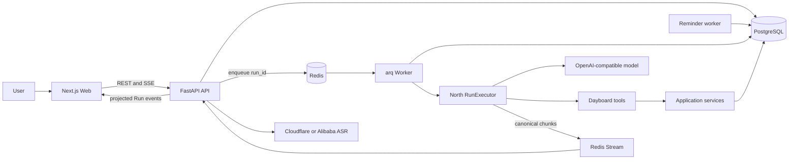

# Current Architecture

This document describes the system implemented on `main`. It does not describe historical phases
or speculative replacements. Run transport details live in [run-lifecycle.md](./run-lifecycle.md),
and product semantics live in [product-model.md](./product-model.md).

## System Map



PostgreSQL is the source of truth for accounts, schedules, conversations, Runs, durable Run events,
reminders, and provider usage. Redis owns queue delivery, rate limits, coordination, and bounded
live StreamBridge replay. Redis is not authoritative product storage.
Conversation bootstrap resolves the owner's primary Thread from PostgreSQL; browser-local state
cannot create a separate history boundary across devices.
The primary Thread is protected by a partial unique database index. Conversation messages use
cursor pagination rather than an unbounded history response; PostgreSQL remains authoritative on
refresh and across devices.

## Ownership

| Boundary | Owns | Must not own |
| --- | --- | --- |
| Web | authenticated presentation, recording gestures, REST/SSE clients | intent policy, trusted identity, persistence |
| FastAPI | auth, validation, tenant context, direct reads/writes, Run creation, SSE framing | long-running Agent execution |
| Worker | queued Run execution, lifecycle hooks, stale-Run recovery, reminder delivery | browser sessions |
| North | generic Agent loop, model/tool execution, canonical runtime streaming | Dayboard product concepts |
| Agent Platform | identity, Conversation/Run contracts, persistence use cases and storage ports | scheduling policy or Dayboard presentation |
| Dayboard Agent | prompt, seven scheduling tools, safe result projection | tenant identity or direct model-authorized writes |
| Services/repositories | deterministic rules, scoped transactions, optimistic concurrency | natural-language interpretation |
| PostgreSQL | durable product and execution state | queue delivery or live fanout |
| Redis | arq queue, rate limits, locks, Redis Streams | durable product truth |

The source-code dependency direction is `Dayboard -> Agent Platform -> North`, equivalently
`North <- Agent Platform <- Dayboard`. A consumer points toward what it imports. Runtime calls,
events, and return values may flow in both directions through declared interfaces without changing
that import direction. North does not understand application identity or persistence; Agent
Platform does not understand calendars, tasks, scheduling prompts, or the Dayboard UI.

## Backend Shape

The reusable application package currently owns shared identity and Conversation/Run contracts:

```text
agent_platform.identity       trusted tenant and user context
agent_platform.conversations product-neutral conversation contracts
agent_platform.conversation_service  conversation history, paging, state and storage ports
agent_platform.runs          product-neutral persisted Run contracts
agent_platform.run_service   storage-independent Run lifecycle and repository ports
```

The Dayboard API package is split by responsibility:

```text
dayboard.api           HTTP, SSE, request and response schemas
dayboard.app           use cases and orchestration
dayboard.agent         prompt, North assembly, presentation projection
dayboard.domain        product models and deterministic validation
dayboard.tools         thin Agent-facing adapters
dayboard.db            SQLAlchemy models, repositories, sessions
dayboard.workers       arq Run and reminder jobs
dayboard.integrations  ASR and external provider adapters
```

Trusted `TenantContext` is resolved from the authenticated server session. Tenant, owner, timezone,
thread, Run, operation keys, and permissions are injected by the runtime and never exposed as
model-supplied tool arguments. Repository queries scope business data by tenant and owner.

Dayboard's composition root connects platform Conversation and Run services to PostgreSQL adapters.
The platform owns persistence use cases, paging, state transitions and lifecycle event policy; the
adapters own SQLAlchemy rows, constraint translation, tenant-scoped queries, and individual database
operations. Dayboard's clarification service owns scheduling candidate validation, local-time
projection, public state filtering, and user-facing choice text.

The extracted services do not yet own an explicit Unit of Work. Multi-repository atomicity currently
depends on Dayboard composing the repositories with one `AsyncSession` and committing at the
application boundary. Command idempotency still uses the Dayboard PostgreSQL repository directly,
and persisted presentation/interaction payloads are unversioned JSON mappings. These are active
extraction gaps, not target platform contracts; the hardening sequence is tracked in
[../agent-platform-extraction.md](../agent-platform-extraction.md).

Writes use PostgreSQL transactions. Scheduling mutations use optimistic concurrency through
`expected_row_version`; retryable Agent writes also use server-derived operation identities.

## Agent Boundary

Natural-language classification happens in the model tool-calling turn. There is no keyword
classifier or second routing model. The model receives bounded conversation context, exact trusted
local date context, scheduling policy, and the currently bound tool schemas.

The model may propose actions, but only tools mutate product data. Tool wrappers inject trusted
context and call services; a successful tool result is based on the committed database object.

The model-visible business tools are:

```text
create_calendar_entry
search_calendar_entries
reschedule_calendar_entry
cancel_calendar_entry
create_task_item
search_task_items
update_task_item
```

`ask_clarification` is a runtime interaction tool rather than a scheduling business tool. Tool
binding narrows to the active calendar or task domain after the first tool result and restores the
full set once when recovery is necessary. See [../tool-design.md](../tool-design.md).

## Frontend Shape

The web application uses Next.js, React, TypeScript, and local shadcn/ui components:

```text
app/page.tsx                         route entry only
features/workspace/DayboardApp.tsx  page orchestration and layout
features/chat/api.ts                typed Conversation and Run REST boundary
features/chat/useConversationSession.ts
                                   Thread, history, active Run, command, and clarification lifecycle
features/chat/runEvents.ts          validated SSE-to-RunEvent decoder
features/chat/useRunStream.ts       EventSource lifecycle and typed Run reducer
features/schedule                   TanStack Query schedule cache and interactions
components/ui                       CLI-managed shadcn primitives
lib/api/schema.d.ts                 generated FastAPI OpenAPI types
lib/api/typedClient.ts              openapi-fetch client and shared error middleware
```

Named SSE events are validated and converted to a discriminated `RunEvent` union before entering
one reducer. EventSource transport callbacks do not inspect arbitrary payload fields or
independently assemble message, progress, and schedule state. Persisted schedule data remains
server-backed in TanStack Query; the reducer holds only conversation presentation state and a
schedule invalidation revision.

API transport types are generated with `npm run api:types`. Handwritten code consumes aliases from
`lib/api/types.ts`, and all ordinary Web REST endpoints use `openapi-fetch`, including Auth, Voice,
Conversation, and Run recovery calls. EventSource framing and named Run-event payload validation
remain a dedicated SSE protocol boundary rather than being forced through the REST client. The API
CI job exports OpenAPI directly
from the current FastAPI application; the Web CI job runs `npm run api:types:check` against that
artifact, so schema drift fails before build or deployment. The generated file is not edited and
is exempt from the 600-line ESLint limit. All handwritten TypeScript and TSX files are limited to
600 lines.

Dayboard theme colors originate in `--dayboard-color-*` variables and map into shadcn theme tokens.
Feature CSS Modules and shared components therefore use the same light/dark theme source.

## Data And Infrastructure

PostgreSQL stores:

- users, credentials, sessions, memberships, and profiles;
- calendar entries, tasks, reminders, and delivery records;
- conversation threads, messages, compaction summaries, and clarification state;
- Agent Runs, durable RuntimeJournal events, and provider usage settlement;
- tenant/owner scope, audit timestamps, soft-deletion state, and Run correlation.

Redis provides:

- arq job delivery using `run_id` as the job identity;
- endpoint and provider-budget counters;
- short-lived coordination;
- per-Run Redis Streams for cross-process canonical message fanout and bounded replay.

Short voice commands are validated, sent synchronously to the configured ASR adapter, normalized to
text, and then enter the normal command path. Raw audio is not persisted. Production currently uses
Cloudflare `whisper-large-v3-turbo`; the Alibaba adapter remains available.

Reminder intent is normalized into PostgreSQL delivery rows. Workers claim due in-app deliveries
with `FOR UPDATE SKIP LOCKED`. The authenticated Web reminder center polls the typed reminder API,
persists read state, and can return failed rows to the Outbox queue. Browser/PWA background push
requires a Service Worker, durable Push subscriptions, Web Push credentials, and a separate
delivery channel; it remains unfinished. The current optional browser Notification is driven by
authenticated foreground polling and is not represented as background delivery.

## Deployment

Docker Compose owns PostgreSQL, Redis, API, Worker, and Web. Nginx terminates the public same-site
connection and proxies the Web and API. Application containers run as non-root users. Host systemd
owns the daily PostgreSQL backup timer, not the application processes.

Operational procedures live in [../deploy.md](../deploy.md) and
[../postgres-backup.md](../postgres-backup.md).

## Invariants

- PostgreSQL remains the product and Run source of truth.
- Redis Streams are live transport and bounded replay, not durable history.
- Worker execution has one production path: North `RunExecutor` plus `StreamBridge`.
- RuntimeJournal events are diagnostics, not the browser's canonical message protocol.
- Tool success follows committed persistence; model text never creates product state.
- Tenant, owner, timezone, Run, and idempotency context are server-controlled.
- Unreleased superseded paths are removed rather than retained as compatibility layers.
