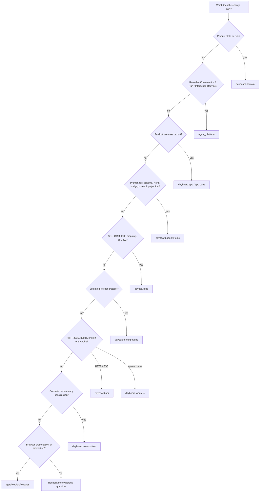

# Current Module Map

This document tells maintainers and coding agents where a change belongs. It describes the code on
`main`, not a speculative package split. Read [architecture.md](./architecture.md) first for system
and ownership boundaries, then use this file before moving or adding backend code.

## Change Routing

Choose the narrowest owner before editing:



| Change | Primary location | Keep out of |
| --- | --- | --- |
| Calendar, task, reminder, or voice state rule | `dayboard.domain` | API, ORM rows, North |
| Product use case or deterministic orchestration | `dayboard.app` | FastAPI routes, repositories |
| Storage/provider interface needed by a use case | `dayboard.app.*_ports` | `db`, API schemas |
| Conversation, Run, Interaction, envelope lifecycle | `agent_platform` | scheduling domain, North |
| Prompt, model-visible schema, tool binding, runtime projection | `dayboard.agent` | Platform, domain entities |
| Serialized scheduling tool operation | `dayboard.tools` and `dayboard.agent.tools` | North, API routes |
| SQLAlchemy row, query, lock, mapping, Unit of Work | `dayboard.db` | application or domain modules |
| Concrete construction of services and adapters | `dayboard.composition` | domain and Platform Core |
| HTTP, auth, request validation, SSE framing | `dayboard.api` | long-running Agent execution |
| Queue or cron entry point | `dayboard.workers` | business rules, provider clients |
| ASR, email, or another external provider adapter | `dayboard.integrations` | product policy |
| Browser presentation and interaction | `apps/web/src/features` | trusted policy, persistence |

If a change appears to require a domain or application module to import `dayboard.db`,
`dayboard.composition`, FastAPI, SQLAlchemy, or North, introduce or reuse an inward-facing port and
wire it in composition instead.

## Dependency Rules

Arrows point from importer to imported code:

```text
api / workers / serialized tool boundaries
  -> composition
  -> app + agent entry points

composition
  -> app + agent + db + integrations + agent_platform

agent Run driver
  -> North + agent_platform ports/application + Dayboard app/domain contracts

app
  -> domain + declared ports + agent_platform contracts/application

db / integrations
  -> app or agent_platform ports + domain/core records

domain
  -> standard library and framework-free value types only

agent_platform
  -> Pydantic and its own core/application/ports; never Dayboard or North
```

`agent_platform` and North are sibling lower-level dependencies. Dayboard's Run driver implements
the Platform execution port by invoking North. Do not introduce `agent_platform -> North` to make a
visually linear stack.

## Package Contracts

### Agent Platform

- **Purpose:** durable, product-neutral identity, Conversation, Run, idempotency, Interaction, and
  versioned-envelope lifecycle.
- **Owns:** framework-free core records, lifecycle services, storage/runtime ports, state-machine
  invariants.
- **Public contracts:** `UserContext`, Conversation and Run records, `PendingInteraction`,
  `PresentationEnvelope`, `EventExtensionEnvelope`, `PlatformUnitOfWork`, `RunExecutionDriver`.
- **Allowed dependencies:** its own layers and framework-free validation types.
- **Forbidden dependencies:** Dayboard, North, SQLAlchemy, FastAPI, product tools and payload meaning.
- **Transaction owner:** Platform application services declare atomic groups; the injected Unit of
  Work commits them.
- **Invariant:** opaque product payloads always have an owner-defined kind and schema version.

### Dayboard Domain

- **Purpose:** deterministic Calendar, Task, Reminder, and Voice state and validation.
- **Owns:** product entities, timing shapes, statuses, value objects, and state rules.
- **Public contracts:** domain records consumed by application ports and adapters.
- **Allowed dependencies:** standard library and framework-free validation.
- **Forbidden dependencies:** app orchestration, API, composition, db, workers, tools, North,
  FastAPI, and SQLAlchemy.
- **Transaction owner:** none; domain code does not commit.
- **Invariant:** product meaning remains explicit rather than becoming a generic JSON `Item`.

### Dayboard Application

- **Purpose:** product use cases and deterministic orchestration over domain records and ports.
- **Owns:** Scheduling, Reminder, Voice, Account Recovery, clarification, query, recovery, and
  command-facing product policy.
- **Public contracts:** application services plus storage/provider protocols in `*_ports.py`.
- **Allowed dependencies:** Dayboard Domain and Agent Platform contracts/application services.
- **Forbidden dependencies:** API, composition, db, integrations, workers, North, FastAPI, and
  SQLAlchemy.
- **Transaction owner:** the outer API, Worker, serialized tool boundary, or a deliberately
  self-contained settlement adapter; services do not hide commits.
- **Invariant:** ORM rows and provider-specific response objects never cross application ports.

### Dayboard Agent

- **Purpose:** Dayboard prompt, model-visible tools, dynamic binding, North assembly, stream
  projection, compact receipts, presentation artifacts, and Run execution bridge.
- **Owns:** scheduling language policy and the conversion between North runtime output and Platform
  execution outcomes.
- **Public contracts:** Agent factory, `DayboardRunExecutionDriver`, result projectors, tool schemas.
- **Allowed dependencies:** North, Agent Platform public contracts, and Dayboard app/domain/tool
  contracts. Serialized tool construction is an outer boundary and may request a composed
  Scheduling scope.
- **Forbidden dependencies:** Platform or North owning Dayboard scheduling semantics; Run driver
  importing API, db, settings, or composition.
- **Transaction owner:** each serialized write tool commits only after its compact receipt and UI
  artifact have been constructed successfully.
- **Invariant:** model-visible receipts contain local product time; complete UTC entities remain in
  UI artifacts and never enter the same model context.

### Database Adapters

- **Purpose:** PostgreSQL schema, SQLAlchemy queries, mappings, locks, constraints, and concrete
  Units of Work.
- **Owns:** ORM rows and translation between rows and framework-neutral records.
- **Public contracts:** implementations of Dayboard application and Agent Platform ports.
- **Allowed dependencies:** domain/core records and declared ports.
- **Forbidden dependencies:** natural-language policy, prompt decisions, HTTP presentation.
- **Transaction owner:** concrete Unit of Work exposes commit/rollback; it does not decide use-case
  atomicity.
- **Invariant:** every product query is user scoped where the contract requires it.

### Composition

- **Purpose:** construct complete API and Worker scopes from settings and concrete adapters.
- **Owns:** dependency wiring only.
- **Public contracts:** small explicit builders for Platform, Runs, Scheduling, Reminders, Voice,
  Account Recovery, and Provider Usage; scopes are used only when callers need a grouped lifecycle
  or transaction boundary.
- **Allowed dependencies:** all concrete outer implementations required for construction.
- **Forbidden dependencies:** product decisions or duplicate workflows.
- **Transaction owner:** none beyond choosing the Unit of Work supplied to an outer caller.
- **Invariant:** no service locator or mutable global request context.

### API And Workers

- **Purpose:** API owns HTTP/auth/SSE boundaries; Worker owns queued and cron entry points.
- **Owns:** transport validation, trusted context resolution, dispatch, job restoration, and commit
  or rollback at declared use-case boundaries.
- **Allowed dependencies:** application services and composition scopes.
- **Forbidden dependencies:** domain policy in routes/jobs or model execution inside API requests.
- **Transaction owner:** the endpoint/job commits the complete use case when its service contract
  assigns that boundary to the caller.
- **Invariant:** queue payloads carry only `run_id`; the Worker restores identity and input from
  PostgreSQL.

### Integrations

- **Purpose:** concrete ASR, email, and future external-provider adapters.
- **Owns:** provider protocol translation, authentication, timeout, and provider-safe failures.
- **Allowed dependencies:** application provider ports and provider SDKs.
- **Forbidden dependencies:** domain policy and database transaction ownership.
- **Invariant:** no database transaction remains open across an external network call.

### Web

- **Purpose:** authenticated mobile presentation, REST/SSE transport, gestures, recording, and
  server-state caching.
- **Owns:** generated OpenAPI consumption, validated Run reducer, TanStack Query caches, and UI-only
  state.
- **Forbidden dependencies:** intent classification, user identity authority, direct persistence,
  or parsing assistant prose into schedule objects.
- **Invariant:** live and refreshed schedule results use the same versioned presentation contract.

## Capability And Transaction Map

| Capability | Durable authority | Atomic boundary | Critical invariant |
| --- | --- | --- | --- |
| Command submission | Platform Run/Conversation rows in PostgreSQL | idempotency claim + Thread resolution + queued Run + user message + `run_created` event | identical retry resolves the existing Run |
| Run transition | Platform Run and durable event | compare-and-transition + corresponding event | model execution occurs outside the transaction |
| Run completion | Platform Run, assistant message, presentation, optional Interaction | terminal state + message + presentation/Interaction | PostgreSQL commits before terminal product event/end sentinel |
| Clarification continuation | Platform Conversation state and Run | idempotency claim + expected-version consume + new Run/message/event | old Run remains terminal; one answer wins CAS |
| Schedule mutation | Calendar/Task and Reminder delivery rows | row-version write + Reminder cancellation/replacement | product write and reminder state cannot diverge |
| Reminder delivery | Reminder delivery plus source projection | source lock + due claim + delivered/expired/cancelled transition | lock source before delivery; queue states are not inbox states |
| Voice transcription | Voice transcript row | commit `processing`; external ASR; separate terminal commit | never hold a transaction across ASR |
| Provider usage | immutable aggregate keyed by user ID and Run | independent user-scoped settlement transaction | accounting failure cannot replace terminal Run outcome |
| Password reset | credential, reset tokens, sessions | password update + token consumption + session revocation | raw reset token is never stored |

## Event And Payload Ownership

| Contract | Envelope/lifecycle owner | Payload meaning owner | Consumer |
| --- | --- | --- | --- |
| `PresentationEnvelope` | Agent Platform | Dayboard | conversation history and Web |
| `EventExtensionEnvelope` | Agent Platform | producing Dayboard/North adapter | durable diagnostics only |
| `PendingInteraction` | Agent Platform | Dayboard clarification schema | continuation API and Web |
| `ToolMessage.content` | North transport | Dayboard compact receipt | model context |
| `ToolMessage.artifact` | North transport | Dayboard presentation part | live projection and persistence |
| Browser `RunEvent` | Dayboard API/Web boundary | Dayboard safe projector | one Web reducer |

Do not replace any of these with an unversioned `dict[str, Any]` public protocol. Do not make
RuntimeJournal extensions the browser message protocol, and do not reconstruct historical cards by
querying current schedule rows.

## Documentation Maintenance

Update this file only when module ownership, allowed dependencies, a public cross-module contract,
or a transaction boundary changes. Update [architecture.md](./architecture.md) for system/process/
data authority changes and [run-lifecycle.md](./run-lifecycle.md) for ordering or recovery changes.
Record reasons for costly decisions in `docs/adr/`; do not duplicate ADRs under another directory.

Do not create one design document per Python file. Add a dedicated module document only when a
stable public contract and several non-obvious invariants cannot be kept clear here; link it from
this map and remove duplicated prose.
